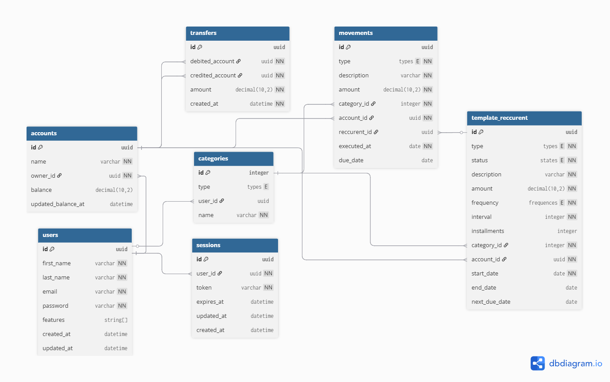

This is a [Next.js](https://nextjs.org) project bootstrapped with [`create-next-app`](https://nextjs.org/docs/app/api-reference/cli/create-next-app).

## Visão Geral

Esse projeto tem como objetivo, ser uma ferrementa útil para aqueles que gostariam de controlar seus gastos financeiros, de um forma mais segura e inteligente.

Sinta-se a vontade para contribuir com o Desenvolvimento dela

## Para executar localmente:

1. Faça o clone do repositório

```bash
git clone git@github.com:AlexandreOliver/finno.git
```

2. Instale as dependências usando pnpm

```bash
pnpm i
```

3. Execute

```bash
pnpm dev
```

Entao acesse [http://localhost:3000](http://localhost:3000)

## Scripts

pnpm \<comand>

- dev: Inicia o Banco de Dados local, roda as migrações e inicia a aplicação
- test: Inicia o Banco de Dados Local e roda a bateria de testes
- test:watch: Roda os testes para desenvolvimento assistido,
- build: Gera o código para a Produção,
- lint: Verifica a estilização do código,
- service:db:up: Sobe o Banco de dados em container docker,
- service:db:down: Para e apaga o banco de dados,
- db:generate: Analisa as modificações no schema e gera as migrações,
- db:migrate: Aplica as migrações - Exige service:db:up,
- db:studio: Cria uma interface web para visualizar o Banco de dados - Exige service:db:up
- db:seed: Popula o Banco com dados - Exige service:db:up
- wait-for-database: Script que espera até que o banco de dados esteja Online

## Esquema do Banco de Dados



### Tabelas

- users - Dedicada a registrar todos os usuarios cadastrados no sistema.
- in progress...

## Regras de Negócios

- in progress...

## Tecnologias

- NextJs
- Drizzle ORM
- Docker

## Caracteristicas

- [ ] Contará com logica de autenicação baseada em sessão
- [ ] Contará com lógica de autorização baseada em Atributos (ABAC)
- in progress..
